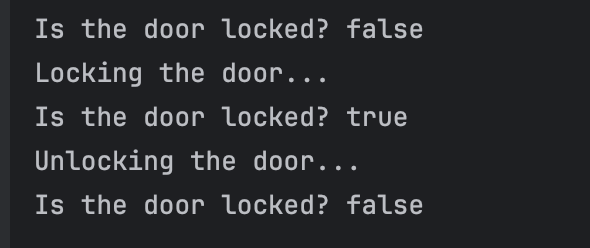

# Mastering Methods and Encapsulation
## Guided Java Lab: Mastering Methods and Encapsulation

## Author
Dzelle Faith R. Tan

## Output
### Exercise 1

### Exercise 2

### Exercise 3

### Exercise 4

### Exercise 5

### Exercise 6

### Exercise 7

### Exercise 8

